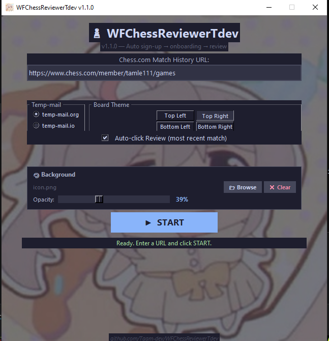

<div align="center">

# ♟ WFChessReviewerTdev

**Automated Chess.com Match Review Helper**

*One-click automation: temp email → match history → sign up → onboarding → review*

[](https://python.org)
[](https://playwright.dev/python/)
[](LICENSE)
[](https://github.com/Taam-dev/WFChessReviewerTdev/releases)



</div>

---

## 📖 What is this?

WFChessReviewerTdev is a lightweight Python desktop tool that automates the tedious process of creating a throwaway Chess.com account just to review someone's match history.

Instead of manually:
1. Getting a temp email
2. Going to the match history page
3. Clicking review
4. Filling out the sign-up form
5. Clicking through 8 onboarding steps

...this tool does it all **automatically in ~15 seconds**.

---

## ✨ Features

| Feature | Description |
|---------|-------------|
| 🔗 **Match History URL** | Paste any Chess.com member's game history URL |
| 📧 **Auto Temp Email** | Fetches temporary email from temp-mail.org or temp-mail.io |
| ✍️ **Auto Sign-Up** | Fills username, email, password with smart typing simulation |
| 🎨 **Board Theme Picker** | Choose your preferred board style (Top Left/Right, Bottom Left/Right) |
| 🚀 **Auto Review** | Optionally auto-clicks the most recent match's Review button |
| 🧭 **Full Onboarding** | Automatically completes all 8 onboarding steps |
| 🖥️ **Clean GUI** | Dark-themed Tkinter interface that doesn't freeze during automation |

---

## 🔧 Requirements

- **Python 3.8+**
- **Playwright** (with Chromium)
- **Tkinter** (included with Python on most systems)

---

## 🚀 Quick Start

### Option 1: Run from source

```bash
# Clone the repo
git clone https://github.com/Taam-dev/WFChessReviewerTdev.git
cd WFChessReviewerTdev

# Install dependencies
pip install -r requirements.txt

# Install Chromium browser for Playwright
python -m playwright install chromium

# Run the app
python main.py
Option 2: Download release
Go to Releases
Download the latest .zip
Extract and run:
Bash

pip install -r requirements.txt
python -m playwright install chromium
python main.py
📋 How to Use
Launch the app → python main.py
Paste a Chess.com match history URL
Example: https://www.chess.com/member/tamle111/games
Choose options:
Temp-mail provider (temp-mail.org or temp-mail.io)
Board theme position (Top Left, Top Right, Bottom Left, Bottom Right)
Auto-review toggle (ON = clicks most recent match automatically)
Click START → sit back and watch the magic ✨
⚙️ Workflow (What happens under the hood)
text

START clicked
  │
  ├─ Tab 1: Open temp-mail site → grab email address
  │
  ├─ Tab 2: Open match history URL
  │    │
  │    ├─ (Auto-review ON) → Click first Review button
  │    └─ (Auto-review OFF) → Wait for user to click Review
  │
  ├─ Sign-up modal appears
  │    ├─ Fill username (UUID-based, unique)
  │    ├─ Fill email (from temp-mail)
  │    └─ Fill password (random, secure)
  │
  ├─ Click Sign Up
  │
  ├─ Onboarding (8 steps, ~7 seconds)
  │    ├─ 1. Chess Experience → select
  │    ├─ 2. Continue
  │    ├─ 3. Coach → Continue
  │    ├─ 4. Board theme → pick your choice
  │    ├─ 5. Continue
  │    ├─ 6. Skip
  │    ├─ 7. No, thank you (ad 1)
  │    └─ 8. No, thank you (ad 2)
  │
  └─ ✅ Done! Browser stays open for you to review games.
🗂️ Project Structure
text

WFChessReviewerTdev/
├── main.py              # Main application (single file)
├── requirements.txt     # Python dependencies
├── LICENSE              # MIT License
├── README.md            # This file
├── .gitignore           # Git ignore rules
└── assets/
    └── screenshot.png   # App screenshot for README
⚠️ Disclaimer
This tool is for educational and personal use only. It is designed to help users quickly review publicly available chess games. Please use responsibly and in accordance with Chess.com's Terms of Service.

The developers are not responsible for any misuse of this tool or any consequences arising from its use.

🤝 Contributing
Contributions are welcome! Feel free to:

Fork the repo
Create a feature branch (git checkout -b feature/amazing-feature)
Commit your changes (git commit -m 'Add amazing feature')
Push to the branch (git push origin feature/amazing-feature)
Open a Pull Request
📝 License
This project is licensed under the MIT License — see the LICENSE file for details.

🙏 Credits
Made with ❤️ by Taam-dev

Built with:

Python
Playwright
Tkinter
<div align="center">
⭐ Star this repo if you find it useful!

</div> ```